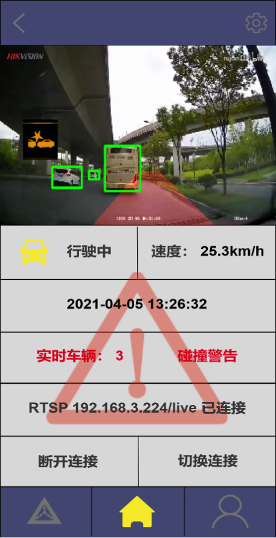
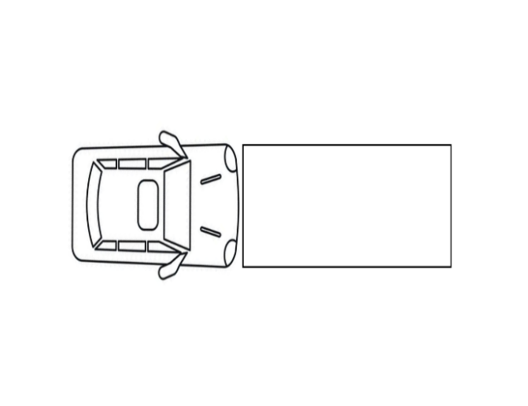
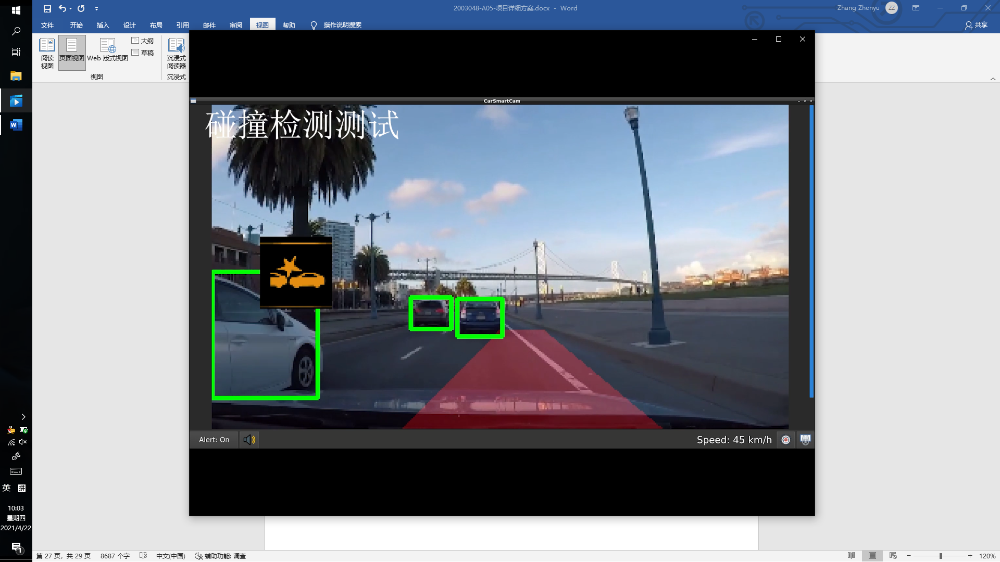

目录

>   

>   

>   

>   

>   

>   

>   

>   

>   

>   

>   

>   

>   

>   

>   

>   

# 第一章 需求分析

## 1.1 行业背景和现状

汽车作为大件耐用商品，对于民众的生活质量水平提高，具有显著作用。而当前，我国正处于汽车的爆发和快速推广期，国内汽车的保有量也是在快速增长。根据国家统计局发布的2020年国民经济和社会发展统计公报显示，截至2020年末，全国民用汽车保有量28087万辆(包括三轮汽车和低速货车748万辆)，比上年末增加1937万辆。其中，私人汽车保有量24393万辆，增加1758万辆。我国的千人汽车保有量从原来不到10辆快速增长到180多辆，达到全球平均水平。而汽车保有量的快速增长带来的是人们对行车安全的大量关注。世界卫生组织报告中统计，全球每年由机动车盲区引发的交通事故多达50万起，高达5000万人在交通事故中受伤，约130万人失去生命。中国公安部最新数据显示，2020年中国道路交通事故万车死亡人数为1.66人；2019年中国交通发生数量为24.8万起，直接财产损失为13.46亿元，导致62763人死亡，256101人受伤。从图中很直观的看到，我国道路交通事故的发生频次、死亡数量虽有下降趋势，但基数仍然很大。不仅城市交通事故现状不容乐观，高速公路事故也呈逐年上升趋势。大量研究表明，道路交通事故的发生一般是由于驾驶员的疏忽、经验不足或是车辆的视觉盲区引起的。解决机动车的盲区问题已经成为当今社会一件刻不容缓的大事。

图1-1-1 2014-2020机动车及汽车保有量    图1-1-2 2014-2020交通事故量和直接财产损失

图1-1-3 2014-2020交通事故死亡和受伤人数 图1-1-4
2014-2020道路交通万车死亡人数及增速

## 1.2 商业价值

全球和中国汽车安全系统近年来发展迅速，2018年全球汽车安全系统市总销售额大约513.78亿美元，到2025年有望达到702.46亿美元，2019到2025年的复合增长率为4.99%。中国是全球汽车安全系统市场份额最大的区域，2018年市场份额达到了27.15%。

在消费市场，全球消费增长率稳定。由于先进的生产技术和经济的快速发展，北美、欧洲、中国、日本、东南亚、印度仍然是主要的消费地区。预计到2025年，汽车安全系统的全球市场将从2014年的36536百万美元达到约70246百万美元。

市场规模方面，2019年全球汽车安全系统市场规模达到了3409亿元，预计2026年将达到4769亿元，年复合增长率(CAGR)为5.0%。

随着经济的发展，各国对行车安全的要求将越来越严格，汽车安全系统的需求将与日俱增。因此，汽车安全系统在未来具有巨大的市场潜力。而汽车盲点检测系统作为汽车安全系统中极为重要的一部分，必将显示出其极高的商业价值。

## 1.3 用户需求

家用轿车车的发动机基本都是前置安装，前头都有个独立的发动机舱，驾驶员坐在车内，视野会被车头的引擎盖影响，根据车型不同一般会有个2-3米的盲区，在这个车头盲区内驾驶员的视野受到限制，无法观察到路面的具体情况和与周围车辆的距离，容易发生碰撞事故。所以需要通过在车头盲区位置安装摄像头，用来检测车头周围是否存在行人和车辆等易发生事故的因素。

倒车是许多新手司机的噩梦，同时因倒车发生的事故更是数不胜数。车尾盲区包括车辆后挡风玻璃以下区域以及车辆两测车底区域，所以在进行倒车或者侧方位停车时容易因为难以辨别内后轮的位置而发生碰撞甚至是更严重的事故。所以我们需要通过在车尾安装摄像头，对车尾盲区进行检测，并在即将达到危险距离时发出警报，提醒驾驶员。

## 1.4 竞品分析

行车和倒车过程，都离不开倒车镜，市场上减少倒车镜盲区的普遍做法就是在后视镜的边缘加装一块小小的广角后视镜，左右倒车镜加装广角镜后，可提高超车和并线的安全性，有些中高档车型还配有并线辅助技术，通过左右后视镜下的摄像头监测两车后方车辆，并线有危险，系统会发出预警。而在车内倒车镜中加装广角镜，减少了驾驶员对后挡风玻璃下的盲区，可提升倒车的安全性。

马自达汽车公司开发了弯道车速预警系统，利用车载湿度、温度传感器获取道路信息，对道路附着系数进行估算，同时通过离心力平衡方程式计算不同弯道的最大安全速度。如果当前车速超过了最大安全速度，则会发出预警信息。

沃尔沃公司已经率先公开展示了＂骑行者检测系统＂，可以对自行车突然出现或者盲区内骑自行车的人进行识别检测，并针对危险实现自动刹车。该系统为世界上第一个针对骑行者检测的系统，这也是对沃尔沃汽车之前配备的行人检测系统的探索与升级。其预警信息同时通过视频显示传送给驾驶员，

现在大部分车辆出厂就装了倒车雷达装置，高配车型还有倒车影像和前驻车雷达，更高级的还有全景可视系统，这些装置都能很好的处理盲区问题。

## 1.5 产品规划

1.5.1 产品定位

本智能网联汽车辅助驾驶安全信息检测系统面向所有机动车使用者，用于辅助行车安全，检测正常行驶时视野前方的盲区和倒车行驶时车尾的视线盲区，防止碰撞等行车事故的发生，保障车主的切身财产安全。

1.5.2 核心目标

车尾盲区检测系统通过在车尾（车尾两侧）增加摄像头，实现盲区检测功能，并在临近危险距离时可以发出警报。

预碰撞系统通过在车头（车头俩侧）增加摄像头，实现探测车前方是否有行人或者车辆，并初步识别前方车辆的车型信息以及行人等信息的功能。

两个系统检测出的结果将通过视频流传输至车载中控显示屏中。

# 第二章 系统设计

## 2.1 系统功能结构

智能网联汽车辅助驾驶安全信息检测系统主要由车尾盲区检测系统、预碰撞检测系统和人机交互系统和外部数据总线组成。

1.车尾盲区检测系统：主要完成摄像头视觉图像处理、盲区检测、危险距离识别、处理结果传输的工作。

2.预碰撞检测系统：主要完成摄像头视觉图像处理、行人检测、车辆检测、车道线偏移识别、交通标识识别、处理结果传输的工作。

3.人机交互系统：主要完成系统处理结果接收、识别结果输出展示、声光信号报警提醒、APP数据传输。

4.外部数据总线（需要汽车开放接口）：用于扩展数据接口，为原本车载电子构造数据通路。比如获取车辆实时油门量、方向盘角度、车辆速度、车载GPS数据等原始信息，用于提升辅助驾驶安全系统的探测精度、协助系统做出正确的决策。

图2-1 系统功能结构图

## 2.2 硬件框架结构

智能网联汽车辅助驾驶安全信息检测系统的硬件部分主要由摄像头组、传感器接口、Nvidia
Jetson运算单元和树莓派交互控制单元四部分组成。

1.  摄像头组分为车头摄像头组和车尾摄像头组，用于获取车前方和车后方的实时路面视频，从多个角度扫清车辆四周盲区，做到车辆四周环境360°全覆盖。

2.  传感器接口用于扩展外部传感器，利用多传感器融合算法协助视觉环境分析，帮助系统做出正确的决策。

3.  Nvidia
    Jetson运算单元搭载了Nvidia先进的GPU模块。利用GPU编程能够并行处理大量的图像数据，同时利用GPU的并行特性部署神经网络用于图像分析。能够在嵌入式级别的体积与功耗下实现实时的本地图像处理与神经网络推理。有机会在不牺牲系统性能的情况下提升系统实时性。

4.  树莓派交互控制单元将作为中控设备，用于呈现经过算法分析检测处理后的路面视频，提供车载的人机交互接口。

图2-2 硬件框架图

## 2.3 软件用例图

本用例图囊括了软件层面相关的主要用例，包括了预碰撞检测系统、车尾盲区检测系统和人机交互系统在内的三个主要子系统的九个用例。

图2-3 软件用例图

2.3.1 图像获取

简要说明：该用例允许系统通过装载的摄像头组拍摄录制路面的实时视频，并传输到Nvidia
Jetson运算单元上进行下一步的图像处理。

2.3.2 图像传输

简要说明：该用例允许Nvidia
Jetson运算单元通过RTSP视频流将处理分析完成的视频传输至树莓派交互控制单元。

2.3.3 图像显示

简要说明：该用例通过调用OpenCV库函数对传输来的视频进行截图，并以每秒30帧的速度在web页面的image框里进行播放。

2.3.4 报警提醒

简要说明：该用例在接收到碰撞预判或距离识别发送来的警告信息后，将会在树莓派交互控制单元上显示报警信息，提醒用户存在危险。

2.3.5 行人检测

简要说明：车头摄像头组获取的路面视频传输至Nvidia Jstson运算单元上后，通过运行
CenterNet 神经网络算法识别出视频中的行人，并进行框选和标注。

2.3.6 车型检测

简要说明：车头摄像头组获取的路面视频传输至Nvidia Jstson运算单元，通过运行
CenterNet
神经网络算法识别、框选出视频中的车辆，并分析其基本信息，如车型、颜色等。

2.3.7 碰撞预判

简要说明：车头摄像头组获取的路面视频传输至Nvidia Jstson运算单元，通过运行
CenterNet 神经网络算法对车前方的车辆距离进行分析，判断是否有发生碰撞的风险。

2.3.8 盲区检测

	简要说明：车尾摄像头组获取的车后方视频传输至Nvidia Jstson运算单元，通过运行
CenterNet 神经网络算法来判断车尾是否存在如其他车辆等障碍物。

2.3.9 距离识别

简要说明：当车尾出现障碍物时，通过运行CenterNet
神经网络算法来对障碍物的距离进行识别、分析，当距离即将到达危险界限时发送警告信号

## 2.4 软件模块顺序图

2.4.1 车尾盲区检测系统

图2-4-1 车尾盲区检测系统顺序图

用户启动机动车时，会自动开启人机交互系统，并初始化图像显示和报警提醒功能。当车辆准备倒车时，车尾盲区检测系统会自动进行工作。首先会检测摄影头是否正常工作，若出现异常则返回不正常信息来提醒用户，正常则开始获取车后方视频并传输至Nvidia
Jetson运算单元上通过CenterNet神经网络进行车辆识别和距离检测，返回检测的盲区信息的视频数据到树莓派交互控制单元上进行显示，并在即将到达危险距离时发送警告提醒用户。

2.4.2 预碰撞检测系统

图2-4-2 预碰撞系统顺序图

用户启动机动车时，会自动开启人机交互系统，并初始化图像显示和报警提醒功能。当机动车正常向前行车时，预碰撞检测系统开始运行。首先会检测摄影头是否正常工作，若出现异常则返回不正常信息来提醒用户，正常则开始获取路面实时视频并传输至Nvidia
Jetson运算单元上通过CenterNet神经网络进行行人检测、车型检测和碰撞预判，返回检测的行人和车型信息的视频数据到树莓派交互控制单元上进行显示，并在有发生碰撞风险时发出报警提醒。

## 2.5 软件模块数据流图

2.5.1 预碰撞检测系统

图2-5-1 预碰撞检测系统数据流图

预碰撞检测系统的数据主要由实时视频、检测视频和报警信息组成。车头摄像头组获取路面的实时视频，传输至Nvidia
Jetson运算单元上进行算法分析，对行人和车型进行检测，并分析碰撞风险。检测完成的视频通过RTSP视频流传输至树莓派交互控制单元进行视频显示，并在接收到碰撞的报警信息时对用户进行提醒。

2.5.2 车尾盲区检测系统

图2-5-2 车尾盲区检测系统数据流图

车尾盲区检测系统的数据主要由实时视频、检测视频和报警信息组成。车尾摄像头组获取车后方的实时视频，传输至Nvidia
Jetson运算单元上进行车辆识别和距离识别。其中检测视频通过RTSP视频流传输至树莓派交互控制单元进行视频显示；距离识别时若车尾距离小于设定的危险距离时，则触发危险距离警告，发送报警信息至树莓派交互控制单元对用户发出警告。

# 第三章 详细设计

## 3.1 用户交互设计

3.1.1 前端构架与用户交互逻辑

前端主要分为两个部分，一是用于控制检测的主控部分，二是用于实际行车的移动端应用。

移动端应用主要包含了实时碰撞预警，简单的实时建模，视频流的记录与自动连接等功能，使用react-router在场景模拟页面，主界面与设置界面之间跳转。

中控页面主要为开发者设计，除了实时碰撞预警，实时建模等功能外，还提供了QT显示，嵌入式设备负载显示，数据流量显示等功能。

3.1.2 登录界面的设计

登录界面可以选择之前保存的RSTP地址，也可以手动输入新的RSTP地址。之前保存的地址会在登录界面的下端以列表形式展示。

图3-1-2 登录逻辑  

3.1.3 主界面的设计

主界面主要用于简单明了展示系统功能提供报警信息，记录的视频数据可以兼做行车记录仪用，如图3-1-3。

主要展示的数据为接收到的RTSP视频流，车辆行驶状态，车辆速度，时间，实时检测到的车辆数量，RTSP连接情况等数据。

图3-1-3 主界面            图3-1-4 实时建模

3.1.4 简易实时建模界面的设计

简易的实时建模用于展示系统识别到的车辆与行人，直接而清晰。因为技术原因，获取车辆长度以及车辆建模未完善，采用与实际车辆等宽的矩形作为车辆的表示，深灰色区域为车前的碰撞预警区域，绿色矩形代表观测到但安全行驶的车辆，红色矩形代表有碰撞风险的车辆。当出现碰撞风险，会发出警告。如图3-1-4。

3.1.5 设备负载显示界面的设计

数据负载的显示帮助测试人员掌握设备的实时状态。

图3-1-5 设备负载与数据流量(树莓派测试截图)

## 3.2 硬件结构设计

3.2.1 前端交互模块

主要采用树莓派+TFT显示屏+蜂鸣器。

图3-2-1 中控交互硬件

利用这样一个终端来模拟车辆中控，完成最基本的图像展示和警报提醒。

3.2.2 图像数据采集模块：

主要采用MX219摄像头组

图3-2-2 摄像头组

利用摄像头组可以完成全方位视觉数据采集，避免视角盲区。

多个摄像头除了可以完成常规的采集工作，还可以利用视差原理组建双目摄像头组，为以后实现SLAM，生成高精度三维地图提供硬件支持。

3.2.3 高性能运算处理模块

我们选择了Nvidia Jetson嵌入式实时运算平台，Nvidia
Jetson运算单元搭载了Nvidia先进的GPU模块。利用GPU编程能够并行处理大量的图像数据，同时利用GPU的并行特性部署神经网络用于图像分析。能够在嵌入式级别的体积与功耗下实现实时的本地图像处理与神经网络推理。有机会在不牺牲系统性能的情况下提升系统实时性。

图3-2-3 高性能运算处理模块

## 3.3 软件结构设计

软件整体采用面向对象思想设计，按照模块化分层结构开发，主要涉及了Main_window（用户UI界面）、CollisionWarningController（预碰撞检测系统）、LaneDetector（车道线偏移识别模块）、ObjectDetector（目标检测模块）、TrafficSignClassifier（路标检测模块）、CarStatus（车辆状态信息共享模块）、CameraModel（摄像头图像采集处理模块）、CANReader（车辆外部数据总线接口模块）。整体的软件层级框架如下图所示：

图3-3 软件程序层级框架

接下来我们重点介绍几个核心的模块程序结构。

3.3.1 ObjectDetector模块

3.3.1.1 主要功能

通过对交通目标（包括行人、车辆、标线、路标等）的识别来实现碰撞预警和盲区检测的输入数据，再通过响应的算法分析，来实现碰撞预警和盲区检测。

3.3.1.2 神经网络框架

目标检测识别往往在图像上将目标用矩形框形式框出，该框的水平和垂直轴与图像的水平和垂直向平行。大多常见的目标检测器都先穷举出潜在目标位置，然后对该位置进行分类，进而再实现目标框选，但是这种做法浪费时间，低效，还需要额外的后处理。为了避免以上的问题，并考虑到汽车安全系统这个实时性较高的使用场景，我们致力于提高神经网络传递的效率，提升系统实时性，所以选择了CenterNet
作为我们的目标检测网络。该网络通过关键点估计来寻找对象的中心点，并回溯到其他属性如大小、三维坐标、方向和姿态。

图3-3-1-2-1 CenterNet原理 摘自[》](https://arxiv.org/pdf/1904.07850.pdf)

根据实验数据，我们可以看出来采用关键点估计的方式再回溯物体的其他属性可以极高地提升网络的实时性，缩短推理所花费的时间。以下是在COCO
AP下CenterNet与其他主流神经网络如FasterRCNN、RetinaNet、YOLOv3的性能对比：

图3-3-1-2-2 Speed-accuracy trade-off on COCO validation for real-time detectors.

摘自[》](https://arxiv.org/pdf/1904.07850.pdf)

因为该网络具有简单性和高效性，能够在嵌入式平台上高速运行，协助我们实时完成交通目标的识别，所以选择它作为我们的目标检测网络。

3.3.1.3 神经网络模型训练

我们采用了目前比较主流的自动驾驶数据集，伯克利大学的Berkeley
DeepDrive（BDD100K）数据集来训练CenterNet。Berkeley
DeepDrive数据集由超过100K的视频序列组成，包含各种各样的注释，包括图像级标记、对象边界框、可行驶区域、车道标记和全帧实例分割。数据集具有地理、环境和天气多样性，这对于训练模型很有用，因此外部环境对识别结果影响较小。

3.3.1.4 模型优化

**PyTorch 到 TensorRT 引擎转换**

根据相关实验和数据我们得知在推断过程中，基于 TensorRT
的应用程序的执行速度比只支持 CPU 的平台快40倍。使用
TensorRT，可以优化在所有主流框架中训练的神经网络模型，以高精度校准低精度，并部署到超级数据中心、嵌入式或汽车产品等平台中。所以我们需要将模型文件转换为TensorRT引擎支持的ONNX格式文件。

这里我们主要需要将pyTorch训练好的模型文件导出成ONNX模型文件，ONNX是一种针对机器学习所设计的开放式的文件格式，用于存储训练好的模型。它使得不同的人工智能框架（如Pytorch,
MXNet）可以采用相同格式存储模型数据并交互。 ONNX的规范及代码主要由微软，亚马逊
，Facebook 和 IBM
等公司共同开发，以开放源代码的方式托管在Github上。目前官方支持加载ONNX模型并进行推理的深度学习框架有：
Caffe2, PyTorch, MXNet， ML.NET， TensorRT 和 Microsoft CNTK， 并且 TensorFlow
也非官方的支持ONNX。

我们的转换过程主要参考了Pytorch官方文档，分两种转换模式，第一种是trace-based，不支持动态网络，输入维度固定。第二种是script-based，支持动态网络，输入可变维度。这里我们使用更加简单的trace-based转换模式。

| import torch import torchvision import numpy as np model = torchvision.models.alexnet(pretrained=True).cuda() model.eval() x = torch.rand(1, 3, 224, 224).to("cuda") with torch.no_grad():   predictions = model(x) trace_backbone = torch.jit.trace(model, x, check_trace=False) torch.onnx.export(trace_backbone, x, "alexnet.onnx", verbose=False, export_params=True, training=False, opset_version=10, example_outputs=predictions) \# 运行onnx的示例 import onnxruntime as ort ort_session = ort.InferenceSession('alexnet.onnx') onnx_outputs = ort_session.run(None, {ort_session.get_inputs()[0].name: x.cpu().numpy().astype(np.float32)}) \# 校验结果 print(predictions.cpu().numpy() - onnx_outputs) |
|------------------------------------------------------------------------------------------------------------------------------------------------------------------------------------------------------------------------------------------------------------------------------------------------------------------------------------------------------------------------------------------------------------------------------------------------------------------------------------------------------------------------------------------------------------------------------------------------------------------------------------------------------------------------------------------------------------------|

代码3-3-1-1

结果输出示例如下：

| [[[-4.7683716e-07 3.5762787e-07 3.8743019e-07 1.1920929e-07   -9.5367432e-07 -1.0728836e-06 -1.4305115e-06 5.9604645e-08   -7.1525574e-07 3.5762787e-07 5.9604645e-08 7.7486038e-07   1.1920929e-07 -5.9604645e-07 4.1723251e-07 -3.5762787e-07   0.0000000e+00 -1.7881393e-07 -1.1920929e-07 1.7881393e-07   ...   4.7683716e-07 -2.3841858e-07 5.6624413e-07 2.3841858e-07   -9.5367432e-07 -7.1525574e-07 2.3841858e-07 5.9604645e-07]]] |
|---------------------------------------------------------------------------------------------------------------------------------------------------------------------------------------------------------------------------------------------------------------------------------------------------------------------------------------------------------------------------------------------------------------------------------------------|

代码3-3-1-2

可以看到差异出现在小数点后第七位数字，转换成功。

3.3.1.5 目标检测实现

构造并加载神经网络模型：

| if (SMARTCAM_OBJECT_DETECTION_MODE == std::string("FLOAT32")) {       net = new ctdet::ctdetNet(SMARTCAM_OBJECT_DETECTION_MODEL, "", ctdet::RUN_MODE::FLOAT32);     } else if (SMARTCAM_OBJECT_DETECTION_MODE == std::string("FLOAT16")) {       net = new ctdet::ctdetNet(SMARTCAM_OBJECT_DETECTION_MODEL, "", ctdet::RUN_MODE::FLOAT16);     } |
|--------------------------------------------------------------------------------------------------------------------------------------------------------------------------------------------------------------------------------------------------------------------------------------------------------------------------------------------------|

代码3-3-1-3

如果找到了模型引擎文件就直接装入神经网络，如果没有找到，就根据模型现场生成引擎文件。

目标检测器对象方法输入与输出参数：

| std::vector\<TrafficObject\> ObjectDetector::detect(const cv::Mat &img, const cv::Mat &original_img) |
|------------------------------------------------------------------------------------------------------|

代码3-3-1-4

调用网络推理接口：

| cv::Mat frame(img); auto inputData = prepareImage(frame, net-\>forwardFace); net-\>doInference(inputData.data(), outputData.get()); int num_det = static_cast\<int\>(outputData[0]); |
|--------------------------------------------------------------------------------------------------------------------------------------------------------------------------------------|

代码3-3-1-5

然后通过outputData来存取网络输出信息，用于绘制框线，标记物体。

3.3.2 collisionWarningController模块

为了标定前方车辆到本车的危险距离，需要将现实中的距离（米）与视频流中的距离（像素）相互对应，利用下方的俯视图（图2）和相机视角的图像（图3），如图将矩形的四个角相互对应，容易得到一组相互对应的关系，计算出透视变换方程组。同时，获取识别到车辆的边框底部到基准线的像素点数，通过透视变换方程组的像素-距离比，转换为实际情况下的车辆距离，从而判断车辆是否在车前危险区域内。

图3-3-2 危险区域判定俯视图         图3-3-3 相机视角的危险区域

计算出变换矩阵后我们可以在图像中框定危险范围，我们以车辆在1.5s内能够行驶的距离作为危险区域的长，以车辆的宽度作为危险区域的宽。通过上述转换关系判定前方车辆有无进入危险区域，是否需要给出警告。

距离检测算法：

| void calculateDistance(); |
|---------------------------|

代码3-3-2-1

从objectDetection模块获得n个交通对象的bounding
box后可以通过透视变换方程从相机视角变换到鸟瞰视角得到objectMask，从而得到交通对象与车辆的真实距离。

| void CollisionWarningController::calculateDistance(const cv::Mat &img, std::vector\<TrafficObject\> &objects) {   int img_width = img.cols;   int img_height = img.rows;   for (size_t i = 0; i \< objects.size(); ++i) {     std::vector\<cv::Point2f\> points;     points.push_back(cv::Point2f(       static_cast\<float\>(objects[i].bbox.x2) / img_width,        static_cast\<float\>(objects[i].bbox.y2) / img_height));     points.push_back(cv::Point2f(       static_cast\<float\>(objects[i].bbox.x1) / img_width,        static_cast\<float\>(objects[i].bbox.y2) / img_height));     std::vector\<cv::Point2f\> transformed_points;    camera_model-\>getBirdViewModel()-\>transformPoints(points,transformed_points);     float max_y = max({transformed_points[0].y,       transformed_points[1].y     });     float distance = camera_model-\>getBirdViewModel()-\>getDistanceToCar(max_y);     objects[i].distance_to_my_car = distance;   } }	 |
|----------------------------------------------------------------------------------------------------------------------------------------------------------------------------------------------------------------------------------------------------------------------------------------------------------------------------------------------------------------------------------------------------------------------------------------------------------------------------------------------------------------------------------------------------------------------------------------------------------------------------------------------------------------------------------------------------------------------------------------------------------------------------------------------------------------------------------------------------------------------------------------------------------------------------------------------------------------|

代码3-3-2-2

通过该方法我们可以较为准确地获得目前与周围物体的距离，这样可以为接下来的碰撞预警系统的预警判断提供相应的基本数据输入。同时不论是车头视频或是车尾视频，这一套算法都是通用的，也在一定程度上获得了代码的复用性。

危险距离判定算法：

| bool isInDangerSituation(); |
|-----------------------------|

代码3-3-2-3

首先设置dangerDistance，由此得到DangerZone，若objectMask和DangerZone的重复区域达到一定的数量，则认为车辆处于危险状态，返回true。

| bool CollisionWarningController::isInDangerSituation(const cv::Size &img_size,       std::vector\<TrafficObject\> &objects) { if (car_status-\>getCarSpeed() \< MIN_SPEED_FOR_COLLISION_WARNING)     {     return false;   }   float danger_distance = car_status-\>getDangerDistance();   cv::Mat danger_zone = camera_model-\>getBirdViewModel()-\>getDangerZone(img_size, danger_distance);   cv::Mat object_mask(img_size, CV_8UC1, cv::Scalar(0));   for (size_t i = 0; i \< objects.size(); ++i) {     cv::rectangle(object_mask, cv::Rect(       cv::Point(objects[i].bbox.x1, objects[i].bbox.y1),        cv::Point(objects[i].bbox.x2, objects[i].bbox.y2)),       cv::Scalar(255), -1);   }   cv::Mat in_danger;   cv::bitwise_and(danger_zone, object_mask, in_danger);   if (cv::countNonZero(in_danger) \> 10) {     return true;   }   return false; } |
|----------------------------------------------------------------------------------------------------------------------------------------------------------------------------------------------------------------------------------------------------------------------------------------------------------------------------------------------------------------------------------------------------------------------------------------------------------------------------------------------------------------------------------------------------------------------------------------------------------------------------------------------------------------------------------------------------------------------------------------------------------------------------------------------------------------------------------------------------------------------|

代码3-3-2-4

利用该方法可以完成预碰撞的大致判定，同时提供了警报阈值的设置接口，可以根据用户需要相应地调节预碰撞检测系统灵敏度，来比较准确地判断车辆是否处于危险状态，为人机交互系统提供是否需要输出声光信号警示的信标。

3.3.3 main模块

Main方法作为整个程序的入口完成了整个软件模块的连接。

其中比较重要的一项功能就是完成各个模块间共享数据的管理，我们使用智能指针的方式共享各模块的数据，同时利用互斥量来避免软件系统因读写共享数据而形成死锁。

| std::shared_ptr\<ObjectDetector\> object_detector;//目标检测模块输出  std::shared_ptr\<LaneDetector\> lane_detector; //车道偏移检测模块输出 std::shared_ptr\<CarGPSReader\> car_gps_reader; //模拟的GPS信号 std::shared_ptr\<CollisionWarningController\> collision_warning; //预碰撞检测模块输出 std::shared_ptr\<CANReader\> can_reader;//共享数据总线接口模块输出  |
|-----------------------------------------------------------------------------------------------------------------------------------------------------------------------------------------------------------------------------------------------------------------------------------------------------------------------------------------------------------------------|

代码3-3-3-1 变量定义

同时为了充分利用CPU资源，我们为各个模块创建了单独的线程，使之可以在Jetson开发板上并行运行，提高硬件资源利用率和软件的执行效率。

| // 创建线程  static void cameraCaptureThread(std::shared_ptr\<CarStatus\>);  static void objectDetectionThread(std::shared_ptr\<ObjectDetector\> object_detector, std::shared_ptr\<CarStatus\> , CollisionWarningController \*collision_warning);  static void laneDetectionThread( std::shared_ptr\<LaneDetector\> lane_detector, std::shared_ptr\<CarStatus\>, MainWindow \*);  static void warningMonitorThread(std::shared_ptr\<CarStatus\> car_status, MainWindow \*main_window); |
|----------------------------------------------------------------------------------------------------------------------------------------------------------------------------------------------------------------------------------------------------------------------------------------------------------------------------------------------------------------------------------------------------------------------------------------------------------------------------------------|

代码3-3-3-2 线程定义

3.3.4 CANReader模块

采集汽车速度作为预警系统启动的条件避免了在汽车未移动，或低速行驶时开启启动导致的不必要的消耗，减少了系统整体的能量需求，减小了系统的压力，延长了待机时间。

采集车速的方案主要有两种：

方案一：通过GPS定位服务间接计算汽车车速。该方案操作较为简单，而且不用接入汽车的整体内部网络，从而避免干扰智能汽车的运行。同时不需要额外的条件，整个系统可以独立于车辆运行，作为汽车的挂载设备有一定优势。但是由于GPS服务的实时性不佳，该方案存在一定的不可避免的延迟，不应应用在对实时性要求较高的碰撞预警系统中。

方案二：连接到汽车的CAN总线获取汽车的实时速度。该方案需要接入汽车的CAN总线，考虑到现在几乎所有的汽车都已经拥有了一个CAN总线用于各部分之间的信息交互，我们只需要提供一个接入CAN总线的接口用于获取汽车的实时速度即可。但是如果汽车厂商没有提供对外接口，该方案难以让普通用户进行操作。

综合考虑两种方案，我们选择了接入CAN总线的设计，保证了系统的实时性与安全性。

3.3.5 CameraMode模块

多个摄像头同时采集到多个视频流后，采用RTSP协议将多个视频流数据同时将数据传输至并行处理单元进行数据处理。RTSP协议，即实时流传输协议（Real
Time Stream
Protocal），支持多个串流同时进行数据传输。同时，经过对实时数据流流量的测算与实验，将整个系统内部的数据流控制在能够被完全传输，不产生拥塞的状态下，从而避免了RTSP协议导致的延迟问题。

# 第四章 测试报告

## 4.1 系统运行环境

算法层面预碰撞检测系统和车尾盲区检测系统采用 Resnet18
神经网络算法，主要由C/C++和Python编写。

本地人机交互系统采用QT框架，主要由C++编写。

网络应用层面是基于Android开发平台，主要采用Java语言编写。

硬件层面采用了Nvidia
Jetson平台作为运算中心，辅以树莓派作为人机交互平台、摄像头组作为图像获取平台。

## 4.2 本地测试

4.2.1 人机交互系统

测试目的：启动并初始化人机交互系统。

图4-2-1 人机交互测试

测试说明：当用户启动机动车时，自动开启人机交互系统并对其进行初始化。初始化完成的人机交互系统主要由视频显示区、声音控制区、速度显示区组成。

4.2.2 预碰撞检测系统

测试目的：激活并应用预碰撞检测系统。

图4-2-2-1 预碰撞检测系统测试

图4-2-2-2 预碰撞检测系统测试

测试说明：当机动车启动向前行驶，预碰撞检测系统自动开始运行。工作内容包括检测车前方的行人、车辆，并判断其与车头的距离，在触发碰撞危险警告时，将会在人机交互系统界面显示报警提醒。

4.2.3 车道线校准

测试目的：测试机动车行驶过程车道线校准和报警功能。

图4-2-3-1 参数设置

图4-2-3-2 参数设置

图4-2-3-3 车道线校准

测试说明：车道线校准功能需要在启动前设置好如图4-2-3-1所示的参数。在行驶过程中，系统根据划分好的车道线标识比照实时路面车道线信息，若发生车道偏移则向用户发出警告。

4.2.4 车尾盲区检测系统

测试目的：激活并应用车尾盲区检测系统

图4-2-4 车尾盲区检测测试

测试说明：当机动车准备进行倒车时，车尾盲区检测系统开始工作。主要用于分辨车尾盲区是否存在车辆、行人等障碍物，并对障碍物进行距离识别，判断是否处于危险距离内，若是则在人机交互系统界面对用户发出危险警告。

## 4.3 网络测试

测试目的：运行手机App端的人机交互界面。

图4-3-1客户端登录     图4-3-2 客户端界面

测试结果：启动手机App，首先需要进行登录操作，同时也需要选择相应的RTSP视频流地址。登录成功后进入显示-操作界面，呈现检测视频、速度信息、时间信息、路面车辆数量等信息，同时也可以选择断开连接或者切换连接操作。
